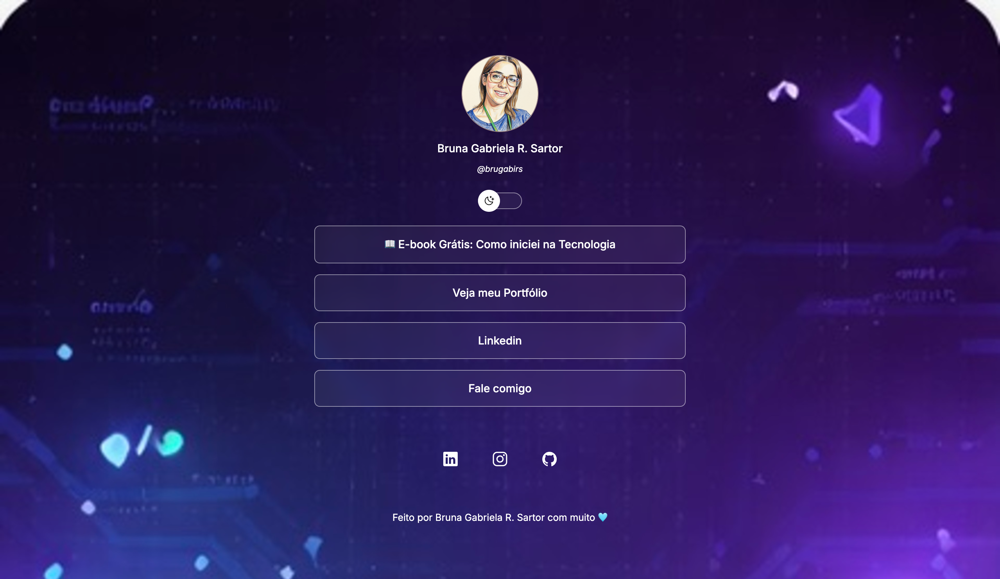
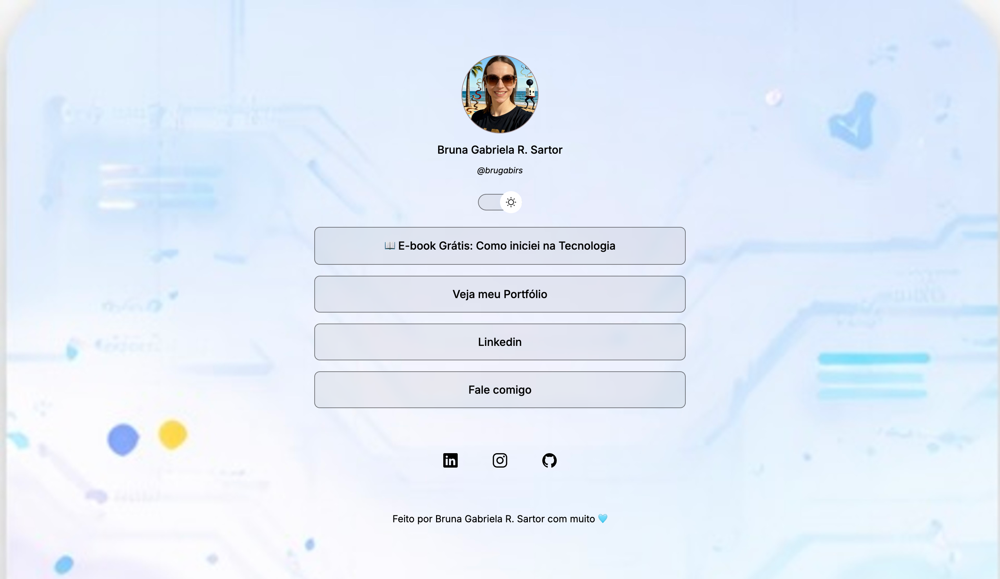

# 🔗 My Links — Página de Links Pessoais

🔗 [Acesse o projeto online](https://brugaby2342.github.io/devlinks)

Uma página de links pessoais desenvolvida com HTML, CSS e JavaScript. O projeto é um desafio do curso Discover pela Rocketseat. Reúne meus principais links em uma interface moderna e com suporte a **modo claro e escuro**.

---

## 📸 Preview

| Modo Escuro | Modo Claro |
|---|---|
|  |  |

---

## ✨ Funcionalidades

- Exibição de links importantes (portfólio, LinkedIn, WhatsApp, e-book)
- Ícones de redes sociais clicáveis
- **Alternância entre modo escuro e claro** com animação suave
- Troca automática da imagem de perfil e do plano de fundo conforme o tema
- Layout responsivo (adaptado para celular e desktop)

---

## 📁 Estrutura do Projeto

```
projeto/
│
├── index.html        → Estrutura da página (o "esqueleto")
├── style.css         → Estilos visuais (cores, fontes, layout)
├── script.js         → Lógica do botão de alternar tema
│
└── assets/           → Imagens e ícones utilizados
    ├── avatar-dark.png
    ├── avatar-light.png
    ├── bg-dark-mobile.jpg
    ├── bg-light-mobile.jpg
    ├── bg-dark-desktop.jpg
    ├── bg-light-desktop.jpg
    ├── moon-stars.svg
    └── sun.svg
```

---

## 🛠️ Tecnologias Utilizadas

| Tecnologia | Para que serve no projeto |
|---|---|
| **HTML** | Estrutura e conteúdo da página |
| **CSS** | Estilização, animações e responsividade |
| **JavaScript** | Lógica de troca de tema (claro/escuro) |
| **Google Fonts** | Fonte *Inter* usada em todo o texto |
| **Ionicons** | Ícones das redes sociais |

---

## 🎨 Conceitos de CSS aplicados

- **Variáveis CSS (`:root`)** — permitem trocar as cores do tema inteiro alterando poucos valores
- **`backdrop-filter`** — efeito de vidro fosco nos botões de link
- **`@keyframes`** — animação de deslizamento do botão de tema
- **`@media query`** — imagem de fundo diferente para telas maiores (desktop)

---

## ⚙️ Como o modo claro/escuro funciona

1. O usuário clica no botão de alternância (switch)
2. A função `toggleMode()` em `script.js` é chamada
3. Ela adiciona ou remove a classe `light-mode` no elemento `<html>`
4. O CSS detecta a classe e aplica as variáveis de cor do tema
5. O JavaScript também troca a foto de perfil para combinar com o tema

---

## 👩‍💻 Autora

Feito com muito 🩵 por **Bruna Gabriela R. Sartor**
